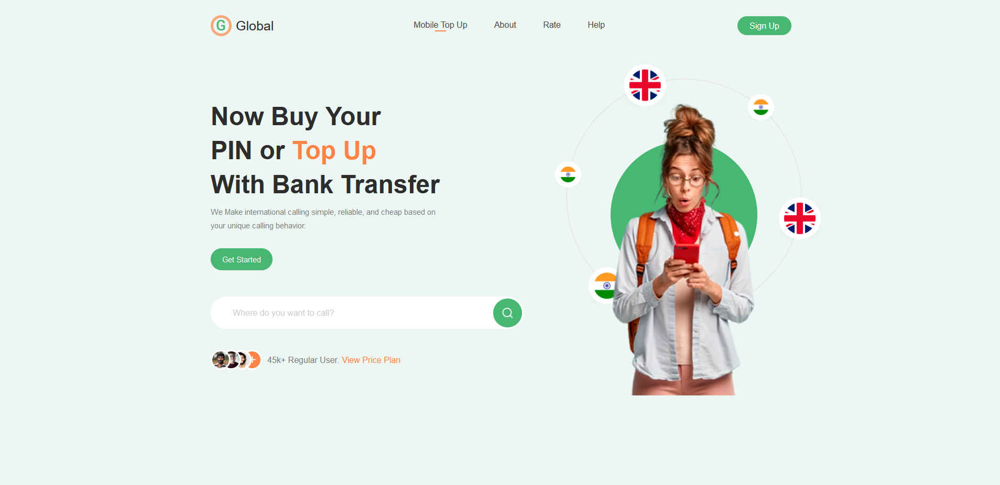

## Global

"Global" is a adaptive single-page. Implemented such things as adaptivity, hiding menu, simple validation of a search form, two-step-animation

It gave me experience at the following points: 
- BEM layout
- Animation handling with keyframes

It was quite simple but interesting layout
	
 *Screenshots of the landing:* 

